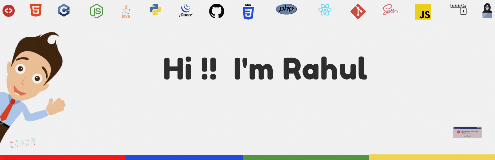
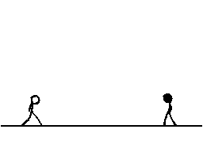

<!--
**iamrahul8/iamrahul8** is a ✨ _special_ ✨ repository because its `README.md` (this file) appears on your GitHub profile.

Here are some ideas to get you started:

- 🔭 I’m currently working on ...
- 🌱 I’m currently learning ...
- 👯 I’m looking to collaborate on ...
- 🤔 I’m looking for help with ...
- 💬 Ask me about ...
- 📫 How to reach me: ...
- 😄 Pronouns: ...
- ⚡ Fun fact: ...

 👋🏼 👨🏻‍💻 
-->

 

 

 &nbsp;&nbsp;
&nbsp;&nbsp;
&nbsp;&nbsp;
&nbsp;&nbsp;
 &nbsp;&nbsp;
 &nbsp;&nbsp;

 

<h1 align=""> Good to see you here...</h1>

I am a sophomore pursuing <b>Civil Engineering.</b>
I am a passionate <b>Web Developer</b> & love <b>Competitive Programming</b>👨🏻‍💻 
I am always up for new adventures, meeting new people, and <b>learning</b> new things.
I enjoy the thought of adding value to people's lives and having a positive impact on the world via my work.

 
  
 

 <h2 align="center"> 📶 Stats: </h2> <!---->
 
 <!--Profile view of this yr only-->
  
 
 

  

  <a href="https://github.com/iamrahul8">
  
  

 

  

 
 

 <h2 align = 'Center'>Watch a 🐍 eating my contribution graph</h1>
  
 
  
 

<!-- Tools starts here-->

 <h2 align="center"> Languages and Tools:</h1>

                                          

 
 
 

Github Trophies

  <h2>Github Trophies </h2>
   
   

  

  
@appwrite Maker's Card 💗 

 
   

 
<!-- BLOG-POST-LIST:START -->

 
 
 <h2 align="center"> 📝 Latest Blog Posts</h2>
 
<!--
-->
 
- [WebDesign Process : Know this before beginning](https://medium.com/@iamrahul8/webdesign-process-know-this-before-beginning-845dbc48765e)
- [Error 404 : Page not Found](https://dev.to/iamrahul/error-404-page-not-found-5033)
- [What is NativeScript ?](https://iamrahul.hashnode.dev/what-is-nativescript)
- [Kubernetes or Cloud Foundry : Cloud-Native App Deployment](https://dev.to/iamrahul/kubernetes-or-cloud-foundry-cloud-native-app-deployment-512k)
- [How does DevOps test automation work?](https://community.ops.io/iamrahul8/how-does-devops-test-automation-work-1n1o)
- [What is AWS CodePipeline : Components and Features](https://community.ops.io/iamrahul8/what-is-aws-codepipeline-components-and-features-5gjd)
  
<!-- BLOG-POST-LIST:END -->

 
  
 
 
 
